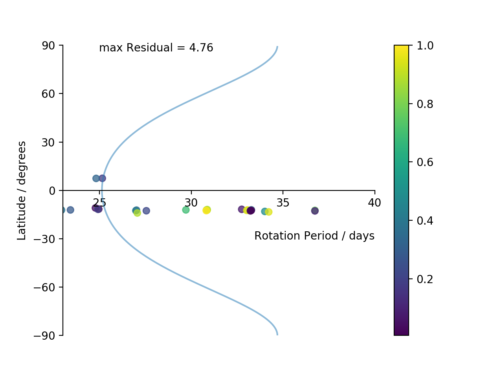
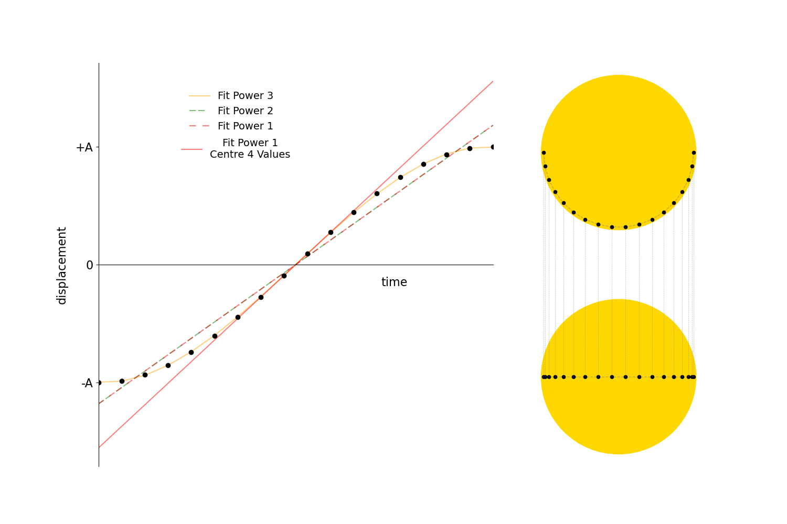

# Sunspots

## sunspotsAuto.py - 
### AIM - To measure the Suns rotation period using real data of sunspots

## theorySunspots.py -
### AIM - To visualise and describe the motion of a sunspot over time using maths and theories

## Intro
Identification of sunspots in SDO HMI continuum images.  
Calculation of the sidereal and synodic rotation periods of the Sun.  
Automatic identification and tracking of sunspots using SunPy.

**sunspotsAuto.py** calculates the rotation period of the Sun using interactive SDO images.

**sun.yml** is a basic env setup that I used to test the code.

**theorySunspots.py** explores some of the theory/maths behind the sunspots motion. The non-interactive **theorySunspots.py** creates the figures prefixed with ***theory*** in the ***figures*** directory.

All the SDO HMI images are in the ***images*** directory (after 1st run of code).  
The ***data*** directory contains data from **sunspotsAuto.py**.  
Figures (gifs, pngs etc) are stored in the ***figures*** directory.

**sunspotsAuto.py** automatically identifies sunspots in an image using **stara.py** and also create tracks/paths  of the sunspots over time and uses the tracks to calcualte the sideral rotation period at different latitudes.

Gif of sunspots identified with **sunspotsAuto.py** and **stara.py**. Sunspot centers (stars) are identified using ***scikit-learn*** DBS Clustering. Notice how the sunspot can appear in one image and dissapear in the next as identified by scikit-learn - perhaps a better clustering algorithim could be used? (hierachical/agglomarate clustering?)

Final output of **sunspotsAuto.py**, each point is a possible sunspot track. Colours are based on the max residual value from the fits plotted. This run was with a pretty wide positional cut and high max residual cut.

Figure created by **theorySunspots.py**.

